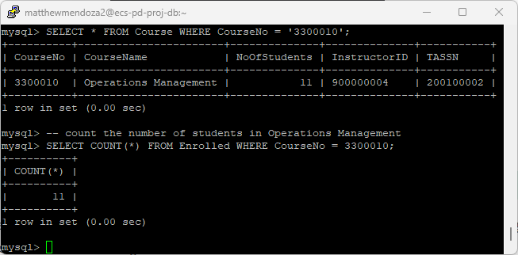
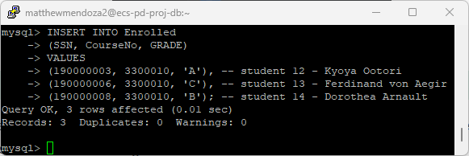
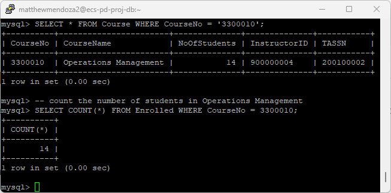
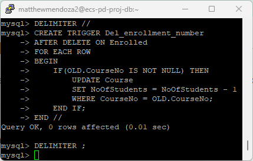
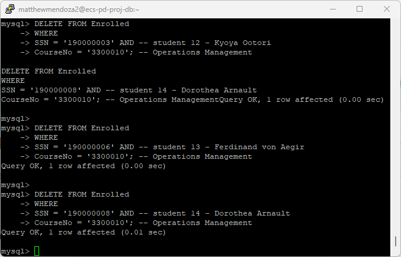
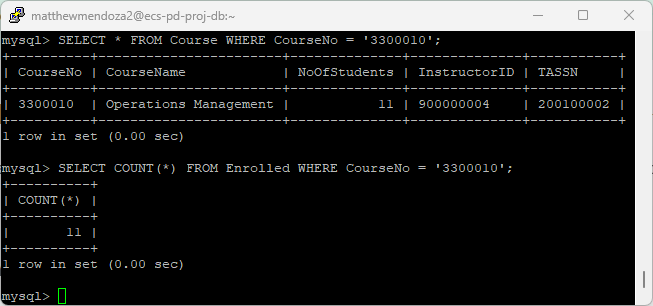

# Matthew Mendoza - Assignment 05 part 1

CSC 174 section 2 Spring 2023

- [Matthew Mendoza - Assignment 05 part 1](#matthew-mendoza---assignment-05-part-1)
  - [Trigger Name : `Inc_enrollment_number`](#trigger-name--inc_enrollment_number)
    - [`Inc_enrollment_number` - Show Current Number Of Students](#inc_enrollment_number---show-current-number-of-students)
    - [`Inc_enrollment_number` - Adding Three Students](#inc_enrollment_number---adding-three-students)
    - [`Inc_enrollment_number` - Show `NoOfStudents` after adding 3 students](#inc_enrollment_number---show-noofstudents-after-adding-3-students)
  - [Trigger Name : `Del_enrollment_number`](#trigger-name--del_enrollment_number)
    - [`Del_enrollment_number` - Show Current Number Of Students](#del_enrollment_number---show-current-number-of-students)
    - [`Del_enrollment_number` - Adding Three Students](#del_enrollment_number---adding-three-students)
    - [`Del_enrollment_number` - Show `NoOfStudents` after removing 3 students](#del_enrollment_number---show-noofstudents-after-removing-3-students)

## Trigger Name : `Inc_enrollment_number`

When add a new record in the Enrolled table, update the
corresponding value of `NoOfStudents` enrolled in the course.

```sql
DELIMITER //
CREATE TRIGGER Inc_enrollment_number
AFTER INSERT ON Enrolled -- after inserting a record into the Enrolled table
FOR EACH ROW
BEGIN -- start the trigger
    IF(NEW.CourseNo IS NOT NULL) THEN
        UPDATE Course -- update the Course table with the new value of NoOfStudents
        SET NoOfStudents = NoOfStudents + 1 -- increment the NoOfStudents by 1
        -- where the CourseNo is the same as the CourseNo in the new record in the Enrolled table
        WHERE CourseNo = NEW.CourseNo;
    END IF;
END //
DELIMITER ;
```


### `Inc_enrollment_number` - Show Current Number Of Students

```sql
/*
 VALIDATION : check the current NoOfStudents in the Course,
 shows all students before Inc_enrollment_number trigger was created.
 Expect 11 students in Operations Management.
*/
SELECT * FROM Course WHERE CourseNo = '3300010';
-- count the number of students in Operations Management
SELECT COUNT(*) FROM Enrolled WHERE CourseNo = 3300010;
```



### `Inc_enrollment_number` - Adding Three Students

```sql
/*
 INSERT CLAUSE - enroll 3 students
    Kyoya Ootori, Ferdinand von Aegir, and Dorothea Arnault
 into Operations Management (CourseNo = '3300010')
*/
INSERT INTO Enrolled
(SSN, CourseNo, GRADE)
VALUES
(190000003, 3300010, 'A'), -- student 12 - Kyoya Ootori
(190000006, 3300010, 'C'), -- student 13 - Ferdinand von Aegir
(190000008, 3300010, 'B'); -- student 14 - Dorothea Arnault
```



### `Inc_enrollment_number` - Show `NoOfStudents` after adding 3 students

```sql
/*
 VALIDATION : check the current NoOfStudents in the Course,
 shows all students after Inc_enrollment_number trigger was created.
 Expect 14 students in Operations Management - 14 NoOfStudents in course.
*/
SELECT * FROM Course WHERE CourseNo = '3300010';
-- count the number of students in Operations Management
SELECT COUNT(*) FROM Enrolled WHERE CourseNo = '3300010';
```



## Trigger Name : `Del_enrollment_number`

```sql
DELIMITER //
CREATE TRIGGER Del_enrollment_number
AFTER DELETE ON Enrolled -- after deleting a record from the Enrolled table
FOR EACH ROW
BEGIN -- start the trigger
    IF(OLD.CourseNo IS NOT NULL) THEN
        UPDATE Course -- update the Course table with the new value of NoOfStudents
        SET NoOfStudents = NoOfStudents - 1 -- decrement the NoOfStudents by 1
        -- where the CourseNo is the same as the CourseNo in the old record in the Enrolled table
        WHERE CourseNo = OLD.CourseNo;
    END IF;
END //
DELIMITER ;
```



### `Del_enrollment_number` - Show Current Number Of Students

```sql
/*
 VALIDATION : check the current NoOfStudents in the Course,
 shows all students before Del_enrollment_number trigger was created.
 Expect 14 students in Operations Management - 11 + 3 = 14 NoOfStudents.
*/
SELECT * FROM Course WHERE CourseNo = '3300010';
-- count the number of students in Operations Management
SELECT COUNT(*) FROM Enrolled WHERE CourseNo = '3300010';
```


### `Del_enrollment_number` - Adding Three Students

```sql
/*
 DELETE CLAUSES - drop 3 students:
    Kyoya Ootori, Ferdinand von Aegir, and Dorothea Arnault.
 into Operations Management (CourseNo = '3300010')
*/
DELETE FROM Enrolled
WHERE
SSN = '190000003' AND -- student 12 - Kyoya Ootori
CourseNo = '3300010'; -- Operations Management

DELETE FROM Enrolled
WHERE
SSN = '190000006' AND -- student 13 - Ferdinand von Aegir
CourseNo = '3300010'; -- Operations Management

DELETE FROM Enrolled
WHERE
SSN = '190000008' AND -- student 14 - Dorothea Arnault
CourseNo = '3300010'; -- Operations Management
```



### `Del_enrollment_number` - Show `NoOfStudents` after removing 3 students

```sql
/*
 VALIDATION : check the current NoOfStudents in the Course,
 shows all students after Del_enrollment_number trigger is created.
 Expect 11 students in Operations Management after the 3 DELETEs above
*/
SELECT * FROM Course WHERE CourseNo = '3300010';
SELECT COUNT(*) FROM Enrolled WHERE CourseNo = '3300010';
```


