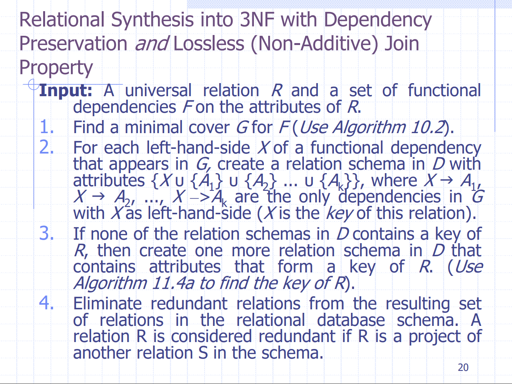
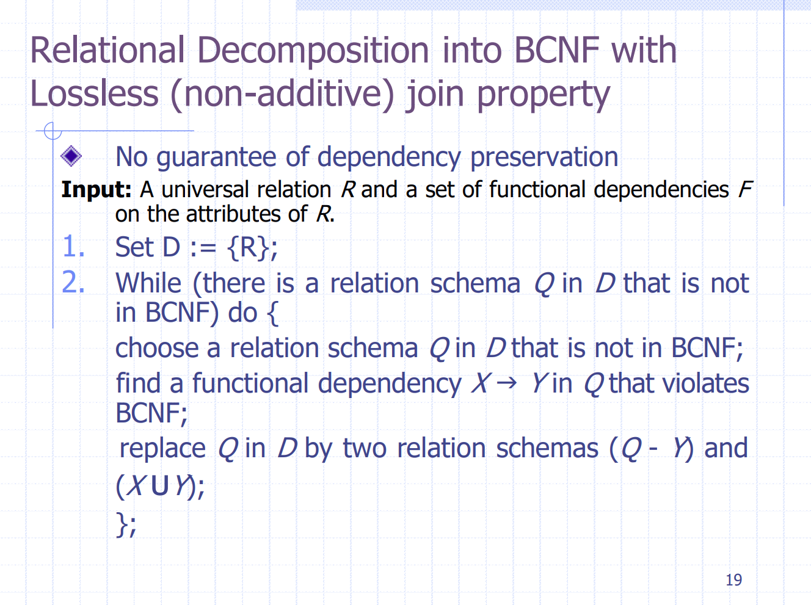

# Hw 5 : Creating Triggers in SQL and Functional Dependencies

Assignment instructions : [Assignment 5](assignment5_prompt.pdf)

- [Assignment 05 Report (part 1) - SQL Triggers](4_result.md)
- [Create Table SQL File](1_create_table.sql)
- [Populate Database SQL File](2_populate_db.sql)
- [Trigger SQL File](3_trigger.sql)
- [Assignment 05 Report (part 2) - Functional Dependencies, Decomposition, 3rd Normal Forms, and BCNF](Assn5_part2.md)

## Hw 5 : Resources That Helped

- Part 2 - question 1 : [University of Virginia CS 4750 Database Systems - Normalization 3NF and BCNF](4750meet10-11-3NF-BCNF.pdf)
- Part 2 - question 2 : [Lecture Notes 10 Slide 20](../lecture-notes/lecture10-normalization-alg.pdf)

- Part 2 - question 3 : [Lecture Notes 10 Slide 19](../lecture-notes/lecture10-normalization-alg.pdf)

