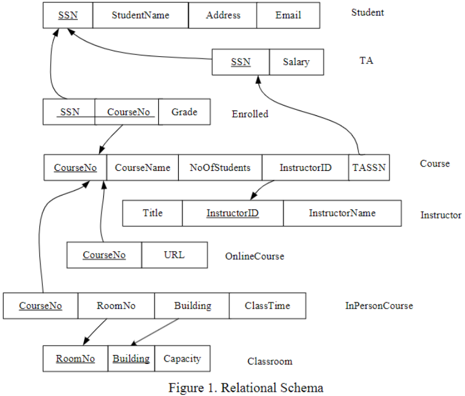
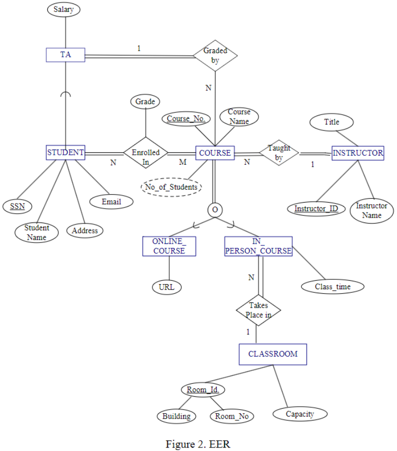

# Matthew Mendoza - Assignment 04

- [Matthew Mendoza - Assignment 04](#matthew-mendoza---assignment-04)
  - [Section 01 - Create tables according to the given schema](#section-01---create-tables-according-to-the-given-schema)
    - [Tables in schema](#tables-in-schema)
    - [Views in schema](#views-in-schema)
  - [Section 02 - Populate the database](#section-02---populate-the-database)
  - [Section 03 - Create additional views: `TA_Course` and `Student_Grade_A`](#section-03---create-additional-views-ta_course-and-student_grade_a)
    - [`TA_Course` View](#ta_course-view)
      - [`TA_Course` View SQL](#ta_course-view-sql)
    - [`Student_Grade_A` View](#student_grade_a-view)
      - [`Student_Grade_A` View SQL](#student_grade_a-view-sql)
  - [Section 04 - Creating a function](#section-04---creating-a-function)

## Section 01 - Create tables according to the given schema

### Tables in schema

```sql
/* Create tables for Student, TA, Course, Enrolled, Instructor, Classroom, OnlineCourse, InPersonCourse */

/* Student */

CREATE TABLE Student
(SSN CHAR(9),
StudentName VARCHAR(30),
Address VARCHAR(30),
Email VARCHAR(30),
PRIMARY KEY (SSN));

/* TA */

CREATE TABLE TA
(SSN CHAR(9),
Salary INTEGER,
FOREIGN KEY (SSN) REFERENCES Student(SSN));

/* Course */

CREATE TABLE Course
(CourseNo VARCHAR(7),
CourseName VARCHAR(20),
NoOfStudents INTEGER,
InstructorID VARCHAR(10),
TASSN CHAR(9),
PRIMARY KEY (CourseNo),
FOREIGN KEY (TASSN) REFERENCES TA(SSN));

/* Enrolled */

CREATE TABLE Enrolled
(SSN CHAR(9),
CourseNo VARCHAR(7),
GRADE CHAR(1),
PRIMARY KEY (SSN, CourseNo),
FOREIGN KEY (CourseNo) REFERENCES Course(CourseNo));

/* Instructor */

CREATE TABLE Instructor
(Title VARCHAR(20),
InstructorID VARCHAR(10),
InstructorName VARCHAR(20),
PRIMARY KEY (InstructorID));

/* Classroom */

CREATE TABLE Classroom
(RoomNo INTEGER,
Building VARCHAR(10),
Capacity INTEGER,
PRIMARY KEY (RoomNo, Building));

/* OnlineCourse */

CREATE TABLE OnlineCourse
(CourseNo VARCHAR(7),
URL VARCHAR(50),
FOREIGN KEY (CourseNo) REFERENCES Course(CourseNo));

/* InPersonCourse */

CREATE TABLE InPersonCourse
(CourseNo VARCHAR(7) REFERENCES Course(CourseNo),
RoomNo INTEGER,
Building VARCHAR(10),
ClassTime VARCHAR(7) NOT NULL,
FOREIGN KEY (RoomNo, Building) REFERENCES Classroom(RoomNo, Building));
```

### Views in schema

Now that the tables are created we need the views to see them

```sql
/* Creating views for tables TA, OnlineCourse, InPersonCourse */

/* Create view for TAs */

CREATE VIEW TAView As 
Select S.SSN, S.StudentName, S.Address, S.Email, T.Salary   
From   Student as S, TA as T  
Where  S.SSN=T.SSN;

/* "Print" items in TAView */

SELECT * FROM TAView;

/* Create view for OnlineCourses */
 
CREATE VIEW OnlineCourseView As 
Select  C.CourseNo, C.CourseName, C.InstructorID, C.NoOfStudents, C.TASSN, W.URL 
From    Course as C, OnlineCourse as W 
Where   C.CourseNo = W.CourseNo; 
 
/* "Print" items in OnlineCourseView */

SELECT * FROM OnlineCourseView;

/* Create view for InPersonCourses */
 
CREATE VIEW InPersonCourseView As 
Select  C.CourseNo, C.CourseName, C.InstructorID, C.NoOfStudents, C.TASSN, T.ClassTime, T.RoomNo, T.Building
From    Course as C, InPersonCourse as T 
Where   C.CourseNo = T.CourseNo; 

/* "Print" items in InPersonCourseView */

SELECT * FROM InPersonCourseView;
```




## Section 02 - Populate the database

## Section 03 - Create additional views: `TA_Course` and `Student_Grade_A`

### `TA_Course` View

A view constructed by a list of students’ names and email addresses who are
teaching assistants. Also get the course names for which they are teaching
assistants.

**Name of the view**: TA_Course

**Attributes of the view**: TA name, TA email, Course name

```txt
CREATE VIEW
-- TA_Course is the name of the view we are creating
SELECT
-- Select the attributes we want to show in the view
    (TA name, TA email, Course name)
FROM
-- From the tables we want to use to create the view
    (Student, TA, Course, Enrolled)
-- The Student table is used to get the TA name and email address
    (SSN is a foreign key in the TA table)
-- The TA table is used to get the TA name and email address
    (SSN is a foreign key in the Student table)
-- The Course table is used to get the course name
    (CourseNo is a foreign key in the Enrolled table)
-- The Enrolled table is used to get the course name
    (CourseNo is a foreign key in the Course table)
WHERE
Join the tables together using the foreign keys (SSN, CourseNo)
-- S.SSN=T.SSN : The TA name and email address is in the Student table and the TA table
    (SSN is a foreign key in the TA table and the Student table)
-- S.SSN=E.SSN : The TA name and email address is in the Student table and the Enrolled table
    (SSN is a foreign key in the Enrolled table and the Student table)
-- C.CourseNo=E.CourseNo : The course name is in the Course table and the Enrolled table
    (CourseNo is a foreign key in the Enrolled table and the Course table)
```

#### `TA_Course` View SQL

```sql
CREATE VIEW TA_Course As
Select S.StudentName, S.Email, T.Salary
From   Student as S, TA as T, Course as C, Enrolled as E
Where  S.SSN=T.SSN AND S.SSN=E.SSN AND C.CourseNo=E.CourseNo;

SELECT * FROM TA_Course;
```

### `Student_Grade_A` View

A view constructed by a list of students who got at least 2 “A” in their course.

**Name of view**: Student_Grade_A

**Attributes of the view**: student ssn, number of A’s gotten

```txt
CREATE VIEW
-- Student_Grade_A is the name of the view we are creating
SELECT
-- Select the attributes we want to show in the view
    (student ssn, number of A’s gotten)
FROM
-- From the tables we want to use to create the view
    (Student, Enrolled)
-- The Student table is used to get the student ssn (SSN)
-- The Enrolled table is used to get the number of A’s gotten (GRADE)
WHERE
-- S.SSN=E.SSN : The student ssn is in the Student table and the Enrolled table
    (SSN is a foreign key in the Enrolled table and the Student table)
-- E.GRADE='A' : The number of A’s gotten is in the Enrolled table and the Enrolled table
    (GRADE is a foreign key in the Enrolled table and the Student table)
GROUP BY
-- Group the items by the student ssn
    (SSN)
-- The student ssn is in the Student table and the Enrolled table
    (SSN is a foreign key in the Enrolled table and the Student table)
HAVING
-- The number of A’s gotten is greater than or equal to 2
    (COUNT(E.GRADE)>=2)
```

#### `Student_Grade_A` View SQL

```sql
CREATE VIEW Student_Grade_A As
Select S.SSN, COUNT(E.GRADE) AS A_Count
From   Student as S, Enrolled as E
Where  S.SSN=E.SSN AND E.GRADE='A'
Group By S.SSN
Having COUNT(E.GRADE)>=2;

SELECT * FROM Student_Grade_A;
```

## Section 04 - Creating a function

Create a function to implement the following requirements:

1. Retrieve the instructor’s name who teaches a given course.
   1. **Function name**: `Course_Instructor`
   2. **Input parameter**: course name
   3. **Return**: Instructor name

When you populate the database, insert data such that the function can return an
instructor name.
