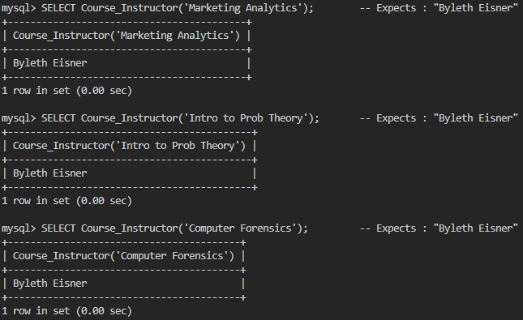
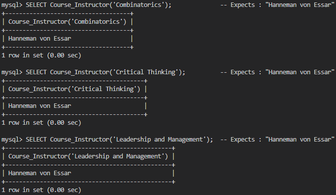
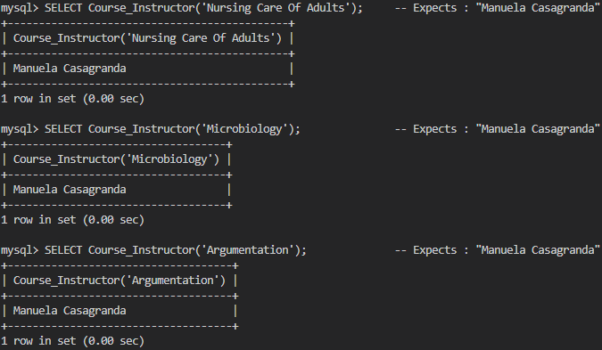
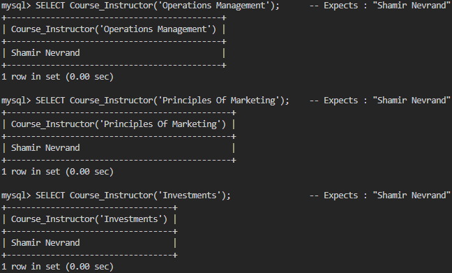
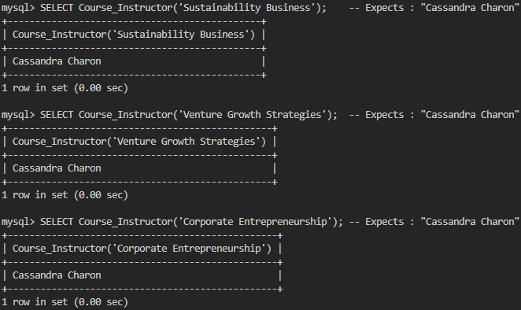

# Matthew Mendoza - Assignment 04

- [Matthew Mendoza - Assignment 04](#matthew-mendoza---assignment-04)
  - [Section 4 - Function](#section-4---function)
    - [Function Call](#function-call)
    - [Function Result](#function-result)
  - [Section 4 - Procedure](#section-4---procedure)
  - [Procedure : `Get_TA`](#procedure--get_ta)
    - [Procedure : `Get_TA` Call](#procedure--get_ta-call)
    - [Procedure : `Get_TA` Result](#procedure--get_ta-result)
  - [Procedure : `GetStudentCourse`](#procedure--getstudentcourse)
    - [Procedure : `GetStudentCourse` Call](#procedure--getstudentcourse-call)
    - [Procedure : `GetStudentCourse` Result](#procedure--getstudentcourse-result)

A PDF file include screenshots (in the following order):

1) Call the function and the results displayed.
2) Call the procedures and the results displayed.

## Section 4 - Function

```sql
/* Function Course_Instructor
 * Input parameter : course name
 * Return : Instructor name
*/
DELIMITER $$
CREATE FUNCTION Course_Instructor (course_name VARCHAR(30))
RETURNS VARCHAR(20)
BEGIN
    DECLARE instructor_name VARCHAR(20);
    SELECT InstructorName INTO instructor_name
    FROM Instructor
    -- so we can use the CourseName input parameter in the
    -- WHERE clause of the outer query to return the InstructorName from the Instructor table
    WHERE InstructorID = (
        SELECT InstructorID
        FROM Course
        WHERE CourseName = course_name
    );
    RETURN instructor_name;
END $$
DELIMITER ;
```

### Function Call

```sql
SELECT Course_Instructor('Marketing Analytics');        -- Expects : "Byleth Eisner"
SELECT Course_Instructor('Intro to Prob Theory');       -- Expects : "Byleth Eisner"
SELECT Course_Instructor('Computer Forensics');         -- Expects : "Byleth Eisner"
SELECT Course_Instructor('Combinatorics');              -- Expects : "Hanneman von Essar"
SELECT Course_Instructor('Critical Thinking');          -- Expects : "Hanneman von Essar"
SELECT Course_Instructor('Leadership and Management');  -- Expects : "Hanneman von Essar"
SELECT Course_Instructor('Nursing Care Of Adults');     -- Expects : "Manuela Casagranda"
SELECT Course_Instructor('Microbiology');               -- Expects : "Manuela Casagranda"
SELECT Course_Instructor('Argumentation');              -- Expects : "Manuela Casagranda"
SELECT Course_Instructor('Operations Management');      -- Expects : "Shamir Nevrand"
SELECT Course_Instructor('Principles Of Marketing');    -- Expects : "Shamir Nevrand"
SELECT Course_Instructor('Investments');                -- Expects : "Shamir Nevrand"
SELECT Course_Instructor('Sustainability Business');    -- Expects : "Cassandra Charon"
SELECT Course_Instructor('Venture Growth Strategies');  -- Expects : "Cassandra Charon"
SELECT Course_Instructor('Corporate Entrepreneurship'); -- Expects : "Cassandra Charon"
```

### Function Result







## Section 4 - Procedure

## Procedure : `Get_TA`

```sql
/* Logic for procedure Get_TA
 Take Instructor_ID as input parameter
   -- Begin procedure body
   -- Print TA names
   -- Course, Student, TA tables are joined together to get TA names for a given instructor
   -- InstructorID is a foreign key in Course table and a primary key in Instructor table
   -- CAST() function converts VARCHAR to INT for comparison with INT column in Course table
   -- End of procedure body
*/
DELIMITER $$ -- Change delimiter to $$ to allow ; in procedure body
CREATE PROCEDURE Get_TA(IN Instructor_ID VARCHAR(20))
BEGIN 
    SELECT S.StudentName
    FROM Course AS C, Student AS S, TA AS T 
    WHERE C.InstructorID=CAST(Instructor_ID AS UNSIGNED INTEGER) AND C.TASSN=T.SSN AND T.SSN=S.SSN;
END $$ -- End of procedure body
DELIMITER ; -- Change delimiter back to ;
```

### Procedure : `Get_TA` Call

```sql
CALL Get_TA("0900000001"); -- Expected : Claude  and Edelgard
CALL Get_TA("0900000002"); -- Expected : Dimitri and Edelgard
CALL Get_TA("0900000003"); -- Expected : Claude  and Dimitri
CALL Get_TA("0900000004"); -- Expected : Claude  and Dimitri and Edelgard
CALL Get_TA("0900000005"); -- Expected : Claude  and Dimitri and Edelgard
```

### Procedure : `Get_TA` Result


## Procedure : `GetStudentCourse`

```sql
/* Logic for procedure GetStudentCourse
 Take Course_Number as input parameter
   -- Begin procedure body
   -- Print SSN, Student Name, Email
   -- Course, Student, Enrolled tables are joined together to get student info for a given course
   -- Course_Number is a foreign key in Enrolled table and a primary key in Course table
   -- End of procedure body
*/
DELIMITER $$
CREATE PROCEDURE GetStudentCourse(IN Course_Number INTEGER)
BEGIN
 SELECT S.SSN, S.StudentName, S.Address, S.Email
 FROM Course AS C, Enrolled AS E, Student AS S
 WHERE Course_Number=C.CourseNo AND C.CourseNo=E.CourseNo AND E.SSN=S.SSN ; 
END $$
DELIMITER ;
```

### Procedure : `GetStudentCourse` Call

```sql
CALL GetStudentCourse('3300001'); -- Marketing Analytics -> Expect 8 students
CALL GetStudentCourse('3300002'); -- Intro to Prob Theory -> Expect 9 students
CALL GetStudentCourse('3300003'); -- Computer Forensics -> Expect 7 students
CALL GetStudentCourse('3300004'); -- Combinatorics -> Expect 9 students
CALL GetStudentCourse('3300005'); -- Critical Thinking -> Expect 8 students
CALL GetStudentCourse('3300006'); -- Leadership and Management -> Expect 11 students
CALL GetStudentCourse('3300007'); -- Nursing Care Of Adults -> Expect 9 students
CALL GetStudentCourse('3300008'); -- Microbiology -> Expect 7 students
CALL GetStudentCourse('3300009'); -- Argumentation -> Expect 10 students
CALL GetStudentCourse('3300010'); -- Operations Management -> Expect 11 students
CALL GetStudentCourse('3300011'); -- Principles Of Marketing -> Expect 7 students
CALL GetStudentCourse('3300012'); -- Investments -> Expect 9 students
CALL GetStudentCourse('3300013'); -- Sustainability Business -> Expect 1 Student
CALL GetStudentCourse('3300014'); -- Venture Growth Strategies -> Expect 1 Student
CALL GetStudentCourse('3300015'); -- Corporate Entrepreneurship -> Expect 1 Student
```

### Procedure : `GetStudentCourse` Result


